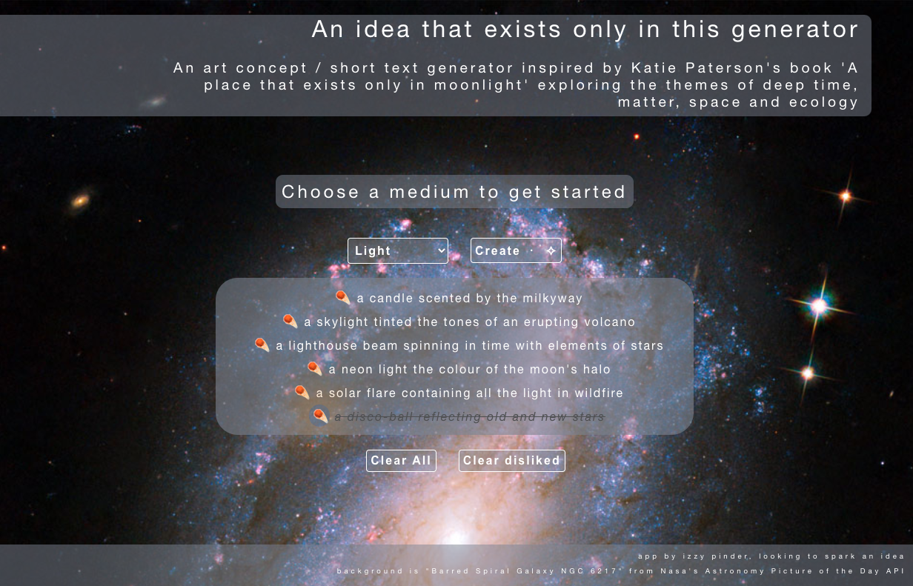
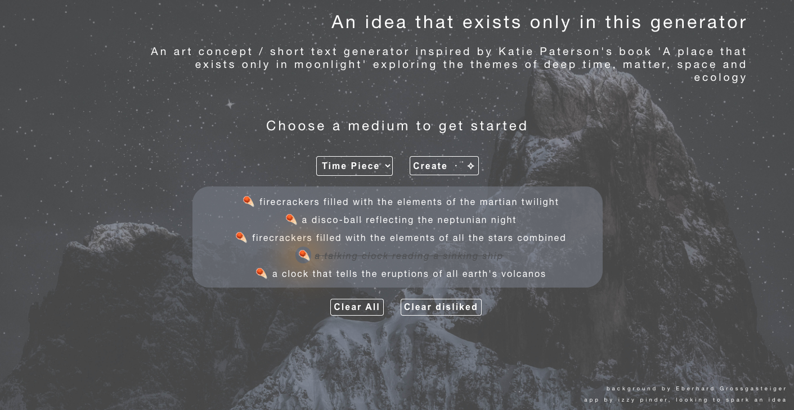

# An idea that exists only in this generator 🌖 🌑 🌔

> **“the reason to copy your heroes and their style is so that you might somehow get a glimpse into their minds"** - Austin Kleon, _Steal Like an Artist: 10 Things Nobody Told You About Being Creative_

## An art concept generator built using React, inspired by the writings of artist [Katie Paterson](http://katiepaterson.org/)

- Users can select an art medium and randomly generate a piece of work on that theme.
- Ideas can be deleted in batches by selecting disliked ones or start afresh by clearing all.
- Local storage is used to make ideas persist between sessions.
- The background image changes daily, using nasa's Astronomy Picture of the Day API.
- - If an error occurs, a default image will display.

## Have a go

Find the live version [here](https://an-idea-that-exists-only-here.netlify.app/)

## Setup

### Clone

- To copy this repo, from your chosen directory in the terminal run the command `git clone https://github.com/izzy-pin/art-idea-generator`
- Navigate into the project folder with `cd art-idea-generator`

### Install dependencies

- To install all the dependencies listed in the package.json, run `npm install` in the root directory of your cloned repo.

### View the site in your browser

- Run `npm start` in the terminal to start the server and to see live changes to the site as you save them.

### Technologies used

- Node.js v16.9.1 (minimum version needed to run locally)
- React v17.0.2

#### A note on styling

- To account for exposure fluctuations in images from nasa's APOD API, text elements will conditionally render with a background when an API call is successful.
  
  
